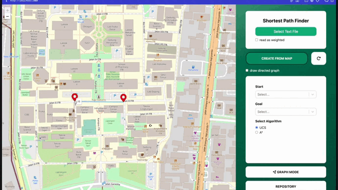
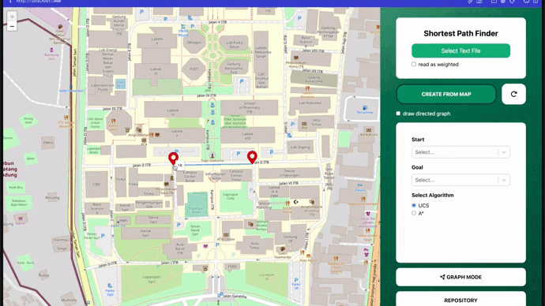

# Shortest Path Finder using UCS and A* Algorithm


This project aims to determine the shortest path between two locations, using the Uniform Cost Search (UCS) and A* (A star) algorithms. The map of the city will be represented by a graph, with nodes representing intersections or end points, and edges representing roads. The weight of each edge is the distance between two nodes, which can be calculated using the Euclidean distance formula or Haversine distance formula (for actual distance in meter and km from latitude and longitude) or Google Map ruler

## Installation
To run this project, make sure you have `Node.js` and `npm` or `yarn` installed on your machine. Then, follow these steps:

1. Clone this repository using git clone https://github.com/debbyalmadea/Tucil3_13521153_13521155.
2. From root, install the dependencies using `npm install` or `yarn install`.

## How to Run
1. First, run the development server:
```
npm run dev
# or
yarn dev
```
2. Open http://localhost:3000 with your browser to see the app.
3. Once the application is running, you can input the desired text file (make sure to read the format of the file first!) or pick the nodes from the map yourself

## About the App
### App Mode
There are two mode that you can use to visualize the graph
1. Graph mode
This mode is useful to visualize graphs that doesn't represent real world map. However, the positioning of the graph **does not reflect** the actual coordinate or weight
2. Map mode
In this mode the graph will be visualized on a map by using [OpenStreetMap](https://www.openstreetmap.org/#map=14/38.4154/-81.4913). You can also create the graph yourself. To do it simply click `create from map` button then `double click` on the desired location to create node. To create an edge, simply `click` on the marker then `hold` your click until you reach another marker!


While creating graph from map, you can choose it to be directed or undirected by checking the **directed button**

To delete a marker, simply `double click` on the existing marker



..and to delete a line, simply `click` on the existing marker then `hold` your click until you reach another marker



### File Input
You can choose how the program will read your text file, wether as weighted matrix or not
1. In weighted input mode, the distance between two nodes are based on the weight. The node's coordinate are used only for heuristic process in A*
2. In non-weighted input mode, the weight of the edge are calculated by euclidean distance between two nodes. The number in the matrix are only used to denote if the edge exist or not

There are three parts in the input file
1. First and on the top is the amount `n` of node/place
2. Second to (n+1)th row is the node description which has format [place-name] [place-x-absis] [place-y-absis]. The place name **do not** include any whitespace. The x-absis and y-absis will only affect heuristic process of A* if you choose `weighted input` mode. Feel free to set it to 0 if you don't want it to affect the process (only in `weighted input` mode) 
3. The next rows are adjency matrix. It represent an edge from `row index` to `col index`. The index is based on the order of the 2nd part. It supports both directed and undirected graph.

Note: Duplicated vertex's name are **not allowed**

Example input for weighted matrix

```
10
AlegriaPark 0 0
NusaLoka 0 0
PuspitaLoka 0 0
AnggrekLoka 0 0
GiriLoka1 0 0
GiriLoka2 0 0
GiriLoka3 0 0
TheGreen 0 0
TerasKota 0 0
PasarModern 0 0
0 5 0 0 10 0 0 0 0 0
5 0 3 0 0 8 0 0 0 0
0 3 0 7 0 0 6 0 0 0
0 0 7 0 2 0 0 4 0 0
10 0 0 2 0 0 0 0 0 0
0 8 0 0 0 0 0 0 0 4
0 0 6 0 0 0 0 3 0 0
0 0 0 4 0 0 3 0 0 5
0 0 0 0 6 0 0 0 0 2
0 0 0 0 0 4 0 5 2 0
```

Example input for non-weighted matrix

```
10
AlegriaPark -6.29801545988442 106.68423915084924
NusaLoka -6.300804327888854 106.68383896334876
PuspitaLoka -6.291781478054693 106.67492939039974
AnggrekLoka -6.301429935223305 106.67146259714181
GiriLoka1 -6.282230822543862 106.66468438179909
GiriLoka2 -6.28330660089096 106.67118881248453
GiriLoka3 -6.284440124156122 106.67325699714175
TheGreen -6.312894843344234 106.66922335076484
TerasKota -6.295339348536524 106.66751888364891
PasarModern -6.304171798672273 106.68476943436377
0 1 1 0 0 0 1 0 0 1
1 0 1 0 0 0 0 0 0 0
1 1 0 1 0 0 1 0 1 1
0 0 1 0 0 0 0 1 1 1
0 0 0 0 0 1 1 0 0 0
0 0 0 0 1 0 1 0 0 0
1 0 1 0 1 1 0 0 1 0
0 0 0 1 0 0 0 0 0 1
0 0 1 1 0 0 1 0 0 1
1 0 1 1 0 0 0 1 1 0
```
### About the Final Distance
1. Total distance is the total weight from start to goal
2. Actual total distance is calculated useing haversine distance formula and used in latitude longitude input

### About the Edge's Label
The edge label represent `<edge weight from input> / <haversine distance>`

## Author
| NIM  | Name |
| ------------- |:-------------:|
| 13521153      | [Made Debby Almadea Putri](https://github.com/debbyalmadea)     |
| 13521155      | [Kandida Edgina Gunawan](https://github.com/kandidagunawan)     |